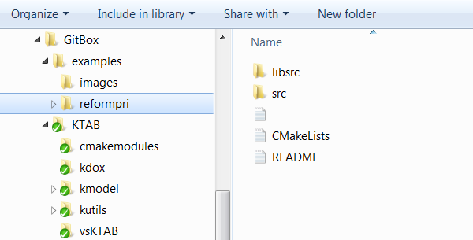

l# KTAB Examples

KTAB is an open-source toolkit for assembling agent-based models of negotiation and bargaining using the Probabilistic Condorcet Election paradigm. Important URLs for KTAB include the following: 

- Home page for [KTAB](http://ktab.kapsarc.org).
- Main [GitHub](https://github.com/) access at [KAPSARC](https://github.com/KAPSARC)/[KTAB](https://github.com/KAPSARC/KTAB)
- Main development site is the King Abdullah Center for Petroleum Studies and Research, [KAPSARC](http://www.kapsarc.org) 
 

The "examples" directory holds examples of how to build models outside the main library structure, as one would do for a custom model.
Note that the entire "examples" directory is parallel to the KTAB directory, as in the following screenshot.

This mirrors the recommended structure for building your own custom models: setup a directory parallel to the main KTAB directory, and build your models there. The CMakeLists.txt file in 'reformpri' uses relative paths that work in the recommended structure, so it can be used as a template for developing your own CMakeLlists.txt files.

Each example contains its own README file which describes that example in more detail. Of course, none of the examples are either calibrated or verified. For rigorous work, one could make whatever local modifications were needed to produce a model which met one's own standards for validation.  
 
----------

If you are interested in contributing code, ideas, or
data to KTAB, please contact ktab@kapsarc.org

----------

Copyright KAPSARC. Open source MIT License.

----------