August 2019

   
#KAPSARC Toolkit for Behavioral Analysis (KTAB): Spatial Model of Politics GUI (SMP) User guide
Version 1.4

This document will act as a user-guide for the KTAB: Spatial Model of Politics GUI. The guide will cover the whole process of using KTAB for the SMP model, taking the user through downloading and Installing the application, running the model, and visualizing the results. This document assumes a detailed understanding of the SMP as instantiated in KTAB. For more details, see two Discussion Papers published by King Abdullah Petroleum studies and Research Center (KAPSARC) [An Introduction to the KAPSARC Toolkit for Behavioral Analysis (KTAB)](https://www.kapsarc.org/research/publications/an-introduction-to-the-kapsarc-toolkit-for-behavioral-analysis-ktab/) and [Multidimensional Bargaining using KTAB](https://www.kapsarc.org/research/publications/multidimensional-bargaining-using-ktab/)

<h4>Table of Contents</h4>

- [Introduction](#introduction)
- [Spatial Model of Politics](#spatial-model-of-politics)
- [How to Install KTAB SMP](#how-to-install-ktab-smp)
    - [Download and Install on Windows](#download-and-install-on-windows)
    - [Download and Install on MAC OS X](#download-and-install-on-mac-os-x)
    - [Building from source for Linux](#building-from-source-for-linux)
- [Getting started with KTAB SMP GUI](#getting-started-with-ktab-smp-gui)
  - [Changing the working directory](#changing-the-working-directory)
  - [Output Log Options](#output-log-options)
  - [Configuring Database](#configuring-database)
  - [Minimum logging](#minimum-logging)
  - [Model Parameters](#model-parameters)
  - [The Affinity Matrix](#the-affinity-matrix)
  - [Data Inputs](#data-inputs)
  - [Actor data description](#actor-data-description)
  - [Create new actor data](#create-new-actor-data)
      - [Data input using a CSV file](#data-input-using-a-csv-file)
      - [Data input using an XML file](#data-input-using-an-xml-file)
- [Output and Results](#output-and-results)
  - [Actor Data](#actor-data)
  - [Visualizations](#visualizations)
    - [Positions By Turn (Line Chart)](#positions-by-turn-line-chart)
    - [Effective Power Landscape (Stacked Bar Chart)](#effective-power-landscape-stacked-bar-chart)
      - [Bar chart scale potions](#bar-chart-scale-potions)
    - [Quad Map](#quad-map)
    - [Changing Actor’s Colors](#changing-actors-colors)
  - [Advanced Visualizations](#advanced-visualizations)
    - [Effective Power Bar Chart (D3)](#effective-power-bar-chart-d3)
    - [Positions Line Graph (D3)](#positions-line-graph-d3)
    - [Network Diagram of Bargains (D3)](#network-diagram-of-bargains-d3)
    - [Other controls for the D3 charts](#other-controls-for-the-d3-charts)
    - [Customize Chart Size and Download as an Image](#customize-chart-size-and-download-as-an-image)
    - [Change Actors Colors](#change-actors-colors)
    - [Actors Groups](#actors-groups)
      - [Sample groups CSV file](#sample-groups-csv-file)

## Introduction
KAPSARC Toolkit for behavioral analysis (KTAB) is an open source platform for building models to allow the systematic and rigorous analysis of Collective Decision-Making Processes (CDMPs). KTAB is under continual development by KAPSARC to meet the need for widely available, state- of-the-art, supported, and open source software that facilitates the modeling and analysis of collective decision making. The software libraries and source code for KTAB are released on github1 as open source under the MIT license.
CDMPs are those in which a group of individual actors interacts to arrive at a single decision. In both general and technical parlance, CDMPs may be termed bargaining or negotiating. To avoid confusion with legacy interpretations of these words we adopt the term CDMP, but the general meaning remains the same. The deliberations of a corporate board, the internal debates of ruling parties, the voting of electorates, and the haggling between seller and buyer at a market stall can all be viewed as CDMPs, albeit with different actors operating according to different rules. KTAB is intended to support reasonable analyses of the potential outcomes of CDMPs involving a range of modeled groups. In any group, the actors hold different values, positions, and views, which they bring to the CDMP.
KTAB is intended to be a platform that contains a number of models that can simulate CDMPs. The initial model that has been instantiated in KTAB is called the Spatial Model of Politics (SMP). The class of models represented by the SMP has a long history in the academic discipline of political science. More detail on the SMP, and references to the appropriate literature, can again be found in articles available for download on the main KTAB page. The majority of the development team’s current efforts are focused on producing a GUI for the SMP. The official version with a working GUI is now available for download.

## Spatial Model of Politics
The initial model that has been instantiated in KTAB is called the Spatial Model of Politics (SMP). The class of models represented by the SMP has a long history in the academic discipline of political science. The key distinguishing feature of the SMP is that the model assumes that positions can be arrayed along a linear, spatial dimension (usually a single line).
Fundamentally, this implies that differences in position, or advocacy, can be ordered along a position spectrum. Differences in actors’ advocacy (their position) reflect the ordering and magnitude of the political difficulty in moving from one position to another. The “space” between two points on the line measures the level of difference between two positions.
A non-spatial approach has also been implemented in KTAB. We call this the Enumerated Model of Politics (EMP).

## How to Install KTAB SMP
#### Download and Install on Windows
This is for Windows (64-bits)

1- Download and install the Visual C++ Runtime libraries for Visual Studio 2015 or more recent, from the Microsoft support official website.
https://support.microsoft.com/en-us/help/2977003/the-latest-supported-visual-c-downloads
2- Download the latest SMP version from the KTAB official GitHub page 
http://kapsarc.github.io/KTAB/.
3- Extract the contents of the .zip archive to your PC, maintaining the directory structure in the archive.

#### Download and Install on MAC OS X
1- Download the latest SMP version for the Mac OS X from the KTAB official GitHub page http://kapsarc.github.io/KTAB/.
2- Extract the contents of the .zip archive to your PC, maintaining the directory structure in the archive.

> **Important note:** to use the smpc and smpDyn from the downloaded bundle you need to access the contents of the KTAB_SMP bundle. You will find both the smpc and smpcDyn executables in the bundle folder KTAB_SMP.app/Contents/MacOS/

#### Building from source for Linux
Once we have configured and installed all the dependencies. the easiest way to build KTAB on Linux is to run the scripts located in the home directory of KTAB. These are `clean.sh`, `reconfig.sh`, and `build.sh` – they should be run in this order to rebuild all the libraries and models for KTAB.

## Getting started with KTAB SMP GUI
### Changing the working directory
The home directory will store your default model outputs. To change your home directory, go to 
`File > Change Home Directory`

### Output Log Options
You can save the model log output in different ways by indicating which logging option you prefer.
1. Default – Records the SMP model log in a timestamp-named file.
2. Custom - Records the SMP model log in a specific file / location.
3. None - Disable output logging of the SMP model run.

### Configuring Database
You can set the database configuration to either record your model output in SQLite or PosgreSQL databases from 
`File > Configure Database` 

or from the database icon: 

### Minimum logging
Minimum logging allows the user to limit database logging. Checking this disables logging except for: model / data information. You can find the Minimum Logging checkbox within the Model Parameters panel

> Note: If you need complete database output for more advanced data analysis, you should keep this option unchecked.

### Model Parameters
The KTAB version of the Spatial Model of Politics is highly parameterized, with many options that can be set to model collective decision-making processes based on your understanding of how actors behave. We briefly describe the parameters that users can modify without modifying the source code. These parameters can be set either in the GUI application, or stored in an xml-format input file. As previously mentioned, the following descriptions of the model parameters assume a detailed understanding of the SMP model as instantiated in KTAB.
The default value for each model parameter is highlighted in blue in the descriptions below.

- **VictoryProbModel** controls the rate at which the probability of a coalition supporting an option
winning against the coalition proposing it increases as the strength ratios increase. This is part of the Probabilistic Condorcet Election. If Binary is used, the result is the Deterministic Condorcet Winner. 

<table>
  <tr>
    <td rowspan="5">VictoryProbModel</td>
    <td>Linear</td>
    <td>A 2:1 ratio gives a probability of 2/3 to the stronger coalition</td>
  </tr>
  <tr>
    <td>Square</td>
    <td>A 2:1 ratio gives a probability of 4/5 to the stronger coalition</td>
  </tr>
  <tr>
    <td>Quartic</td>
    <td>A 2:1 ratio gives a probability of 16/17 to the stronger coalition</td>
  </tr>
   <tr>
    <td>Octic</td>
    <td>A 2:1 ratio gives a probability of 256/257 to the stronger coalition</td>
  </tr>
    <tr>
    <td>Binary</td>
    <td>Any significant percentage difference gives a probability of 1 to the stronger coalition</td>
  </tr>
</table>

- **ProbCondorcetElection** controls how the limiting distribution of the Markov process, for the Probabilistic Condorcet Election, is computed.
<table>
  <tr>
    <td rowspan="3">ProbCondorcetElection</td>
    <td>Conditional</td>
    <td>PCE uses single-step conditional probabilities</td>
  </tr>
  <tr>
    <td>Markov Incentive</td>
    <td>PCE uses a Markov process in which challenge probabilities are proportional to the influence of the initiating actor(s)</td>
  </tr>
  <tr>
    <td>Markov Uniform</td>
    <td>PCE uses a Markov process in which challenge probabilities are uniform</td>
  </tr>
</table>

- **StateTransition** controls how the winning bargain in an actor's queue is chosen among all bargains; either by a Deterministic or Probabilistic Condorcet Election.
<table>
  <tr>
    <td rowspan="3">StateTransition</td>
    <td>Deterministic</td>
    <td>The bargain which has the strongest coalition wins, even with a very small margin</td>
  </tr>
  <tr>
    <td>Stochastic</td>
    <td>The probability of winning for each bargain is proportional to its relative coalition strength</td>
  </tr>
</table>

- **VotingRule** controls how the amount of influence an actor will exert between two options depends on the perceived difference in utilities.

<table>
  <tr>
    <td rowspan="6">VotingRule</td>
    <td>Prop</td>
    <td>The vote is linearly proportional to the difference in utilities</td>
  </tr>
  <tr>
    <td>PropBin</td>
    <td>The vote is proportional to the weighted average of Prop (80%) and Binary (20%)</td>
  </tr>
  <tr>
    <td>Binary</td>
    <td>The actor exerts all influence, regardless of the difference in utilities</td>
  </tr>
   <tr>
    <td>PropCbc</td>
    <td>The vote is proportional to the average of Prop and Cubic</td>
  </tr>
    <tr>
    <td>ASymProsp</td>
    <td>Influence is exerted asymmetrically: It is proportional to the difference of utilities if negative (a loss in utility). It is proportional to 2/3 of the difference, if positive (a gain in utility).</td>
  </tr>
      <tr>
    <td>Cubic</td>
    <td>The vote is proportional to the cubed difference in utilities</td>
  </tr>
</table>

- **BigRAdjust** controls how accurately actor i is able to estimate, relative to an anchor of its own risk attitude, the risk attitude of actor j (which is known to the model).

<table>
  <tr>
    <td rowspan="6">BigRAdjust</td>
    <td>OneThird</td>
    <td>Actor i estimates actor j's risk attitude by
interpolating between them, such that its estimate is closer (2/3 anchored, 1/3 adjusted) to its risk attitude</td>
  </tr>
  <tr>
    <td>None</td>
    <td>Actor i judge’s actor j's risk attitude as being identical to its risk attitude</td>
  </tr>
  <tr>
    <td>Half</td>
    <td>Actor i estimates actor j's risk attitude by interpolating midway between its risk attitude and actor j's actual risk attitude</td>
  </tr>
   <tr>
    <td>TwoThirds</td>
    <td>Actor i estimates actor j's risk attitude by interpolating between them, such that its estimate is closer (1/3 anchored, 2/3 adjusted) to actor j's risk attitude</td>
  </tr>
    <tr>
    <td>Full</td>
    <td>Actor i judge’s actor j's risk attitude correctly</td>
</table>

- **BigRRange** controls actors' risk tolerances, and hence the curvature of their utility functions.

<table>
  <tr>
    <td rowspan="6">BigRRange</td>
      <tr>
    <td>Min</td>
    <td>Sets risk tolerances in the range [0,1] such that actors with the most probable position are perfectly risk averse (1), while actors holding the least probable position are perfectly risk tolerant (0)</td>
  </tr>
    <td>Mid</td>
    <td>Sets risk tolerances in the range [-1⁄2,1] such that actors with the most probable position are perfectly risk averse (1), while actors holding the least probable position are somewhat risk seeking, with an aversion of -1⁄2</td>
  </tr>
  <tr>
    <td>Max</td>
    <td>Sets risk tolerances in the range [-1,1] such that actors with the most probable position are perfectly risk averse (1), while actors holding the least probable position are perfectly risk seeking (-1)</td>
  </tr>
</table>

- **ThirdPartyCommit** controls how committed a third-party actor k is in a challenge between actors i and j.

<table>
  <tr>
    <td rowspan="6">ThirdPartyCommit</td>
      <tr>
    <td>NoCommit</td>
    <td>controls how committed a third-party actor k is in a challenge between actors i and j.</td>
  </tr>
    <td>SemiCommit</td>
    <td>If the coalition actor joined by k loses, k must take the position of the winning coalition; otherwise it does not need to change position</td>
  </tr>
  <tr>
    <td>FullCommit</td>
    <td>Actor k is fully committed to the coalition it joins, and must adopt the position of the winning coalition</td>
  </tr>
</table>

- **InterVecBrgn** controls how proposed positions are interpolated between the positions of actor i and j in a bargain.

<table>
  <tr>
    <td rowspan="6">InterVecBrgn</td>
      <tr>
    <td>S1P1</td>
    <td>Proposed positions for each actor are computed as a weighted average of their current positions, where the weights are the products of salience and probability of success</td>
  </tr>
    <td>S2P2</td>
    <td>Proposed positions for each actor are computed as a weighted average of their current positions, where the weights are the squared products of salience*probability of success</td>
  </tr>
  <tr>
    <td>S2PMax</td>
    <td>Proposed positions for each actor are computed as asymmetric shifts from their current positions, which is a function of squared salience and truncated difference in probability of success</td>
  </tr>
</table>

- **BargnModel** controls from which actor's perspective the probability of success is used to interpolate bargains.

<table>
  <tr>
    <td rowspan="6">BargnModel</td>
    <td>InitOnlyInterp</td>
    <td>Bargains are only computed from the initiating actor's perspective</td>
  </tr>
  <tr>
    <td>InitRcvrInterp</td>
    <td>Bargains are computed from the perspective of both the initiating actor and receiving actor</td>
  </tr>
  <tr>
    <td>PWCompInterp</td>
    <td>Bargains are computed as an effective power- weighted average of both actor's perspectives</td>
  </tr>
   <tr>
    <td>TwoThirds</td>
    <td>Actor i estimates actor j's risk attitude by interpolating between them, such that its estimate is closer (1/3 anchored, 2/3 adjusted) to actor j's risk attitude</td>
  </tr>
    <tr>
    <td>Full</td>
    <td>Actor i judge’s actor j's risk attitude correctly</td>
</table>

### The Affinity Matrix
The affinity matrix is currently unused in the model; it is a placeholder for intended future development of the algorithm.

### Data Inputs
KTAB SMP uses two main data input formats: Comma Separated Value (CSV) files and Extensible Markup Language (XML) files. We assume in this tutorial that the user understands how to obtain appropriate data.
You can find CSV and XML templates in the `KTAB_SMP\sample_data` folder for the Windows release folder or you can find it in the official KTAB folder of the main GitHub repository under `KTAB\examples\smp\doc\` These templates show how a proper CSV or XML file input is structured for a KTAB SMP input.
The Database file .db is another type of input, holding data from a previously-run model.

### Actor data description

- **“Actor”** data that represents an individual, institution or group (Note: actor must be no longer than 25 characters).
- **“Description”** A description of the actor (Note: description must be no longer than 256 characters).
- **“Influence”** The relative power, or political clout, for the actor.
- **“Position”** The stated position an actor advocates for the specified dimension; this value must
be between 0 and 100.
- **“Salience”** The relative importance to the actor of the specified dimension; salience across all
dimensions must sum to at most 100.
> Note: Influence, Position, and Salience are typically numeric values ranging from 0 – 100
- **“Dimensions”** Each dimension represents, on a continuous spectrum between two extremes, a decision over which actors are trying to influence each other, i.e. a CDMP. By convention, dimensions are represented as the inclusive range [0, 100].
- **“Scenario Name”** Scenario, dataset or project name. “Scenario Description” A description of the Scenario.

### Create new actor data
1. To start creating new actor data you can either;
    • Go to `File > Create New Actor Data`
    • Or Click on the icon from the tool bar 
    • Or use the Keyboard shortcut “Ctrl+N”

2. Insert the number of dimensions for your new data-set 
    
    
    

3. To start typing in your data, you will need to set the Scenario Name and Description
    
    
    

4. You can increase or decrease the number of actors using the buttons +/- buttons
     
    
     

5. You can also click on the “Add Dimension” button to add more dimensions
     
    
     

6. Type in your data in the table
     
    
     

7. You can also Add/Delete dimensions, insert new actors and rename column headers by right clicking on a column from the table.
    
    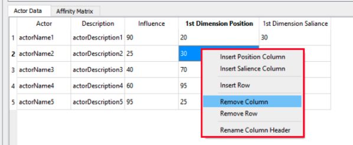
    

8. Once you are done creating your new data-set, click on “Done” to save the data-set on your computer.
   You can either save it in a CSV or an XML file format.

##### Data input using a CSV file
- Go to `File > View/Modify Existing CSV File`
- Or Click on the icon from the tool bar 
- Or use the Keyboard shortcut “Ctrl+O”
  
You can then choose the CSV file that contains the data that you wish to use.

##### Data input using an XML file
- Go to `File > View/Modify Existing XML File`
- Or Click on the icon from the tool bar 
- Or use the Keyboard shortcut “Ctrl+X”

When you are done inserting your input data, the Run button will be highlighted in green for you to run the model.

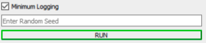

## Output and Results
### Actor Data
The Actor’s Data table shows the current turn, actor’s name and description, actor’s influence, actor’s salience and the position for the current turn. You can navigate through turns with the slider.
    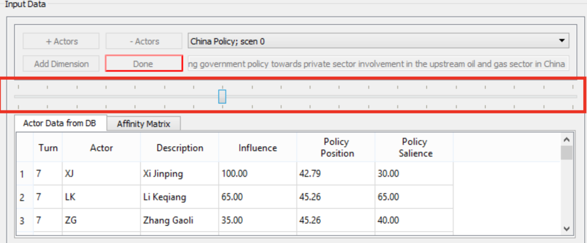
 

The next section introduces the visualizations within the KTAB-SMP application.
You can Hide and View charts from the “View” option on the toolbar.

### Visualizations
#### Positions By Turn (Line Chart)
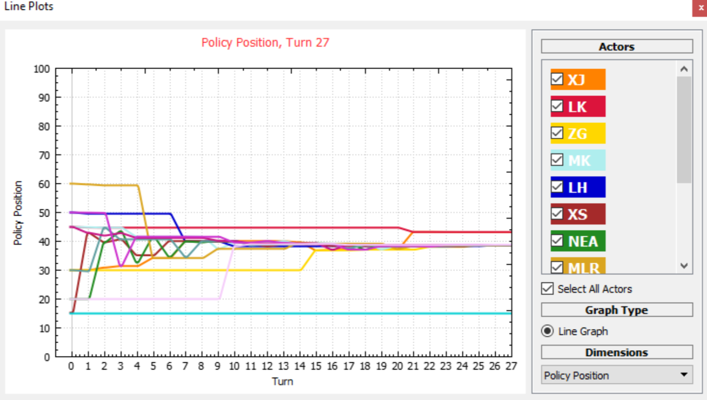
 

The line chart displays the change in the actors’ positions over turns. Each line corresponds to an actor, hovering over a line will trigger a tooltip showing the actor’s name, description, and influence.
In the actor’s controls on the right, you can show/hide the lines through the checkboxes for the actor. You can also switch between dimensions from the “Dimensions” section.

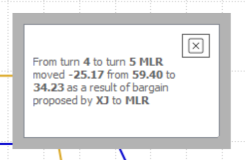

On the chart, you can click on the line to toggle the name of the actor and you can also zoom in/out to change the chart scale.
When you double click on an actor’s line, changing position for a specific turn, a small dialogue box will appear explaining why the actor’s position changed for that turn.

#### Effective Power Landscape (Stacked Bar Chart)
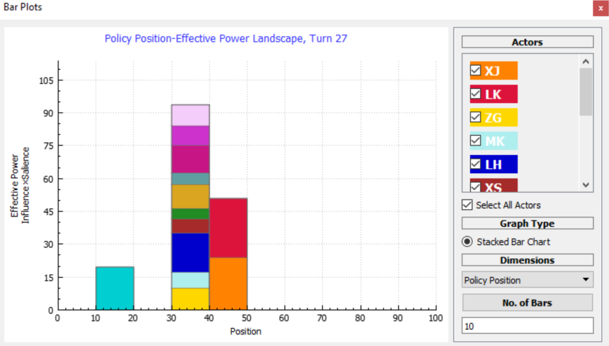
 

The bar chart displays the effective power landscape, showing the effective power and positions of actors for each turn.
Similar to the line chart, in the actor’s controls on the right, you can focus or unfocus bars through the checkboxes for the actors. You can also switch between dimensions from the “Dimensions” section. For the stacked bar chart, you can change the number of bars displayed by modifying “No. of Bars”.

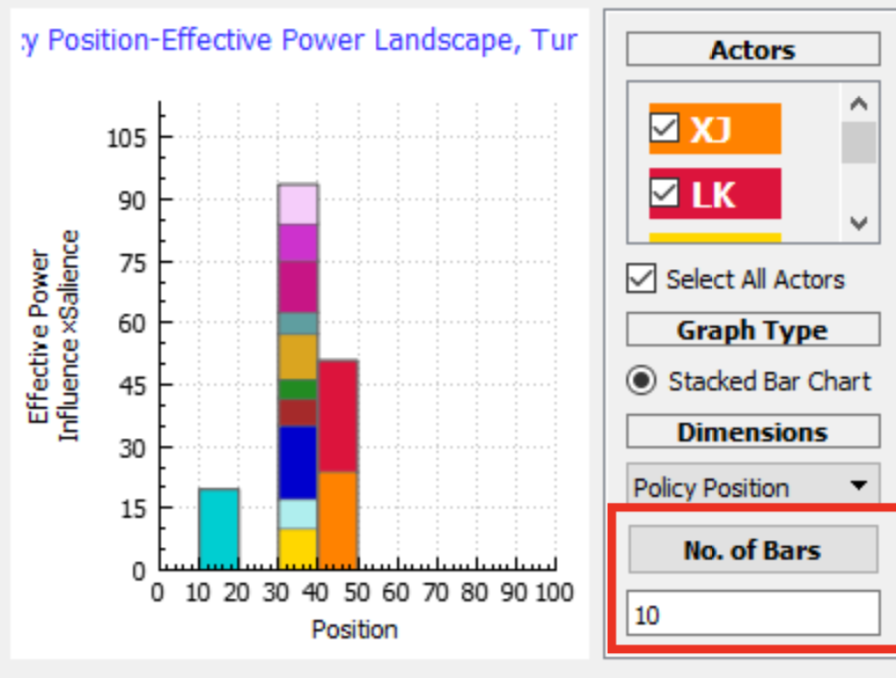 
 

##### Bar chart scale potions
You can change the scale options to automatic, max, or user defined.
- “Automatic” is the default scaling for the bar-chart where the height of the y-axis is responsive and automatic in each turn.
- The “Max” option locks the y-axis on a fixed max scale.
- The “User-defined” option enables the user to define the max value for the y-axis.

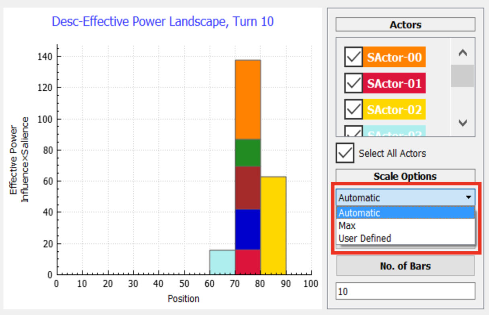
 

#### Quad Map
You can enable the Quad Map view from `View > QuadMap` 
The Quad Map plots the change in utility to both the initiator (y-axis) and receiver (x-axis) expected as a result of a challenge from a specified initiator to at least one other actor.
There are four ways to compute the perspective from which the utility changes are computed:

**Initiator:** All computations performed from the perspective of the initiator.
**Receiver(s):** All computations performed from the perspective of each receiver selected for plotting.
**Objective:** The utilities for the initiator are computed from their perspective, and the utilities to each receiver are computed from their own perspective.
**Other:** All utilities are computed from a specified third party.

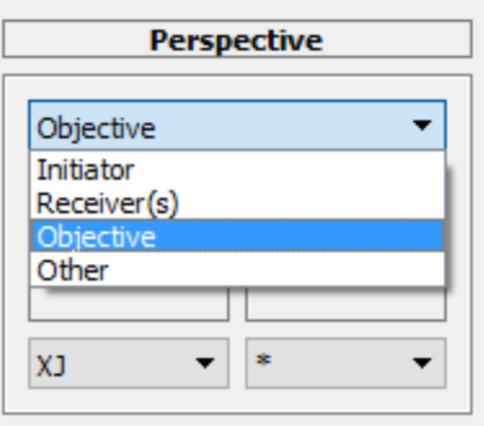

 

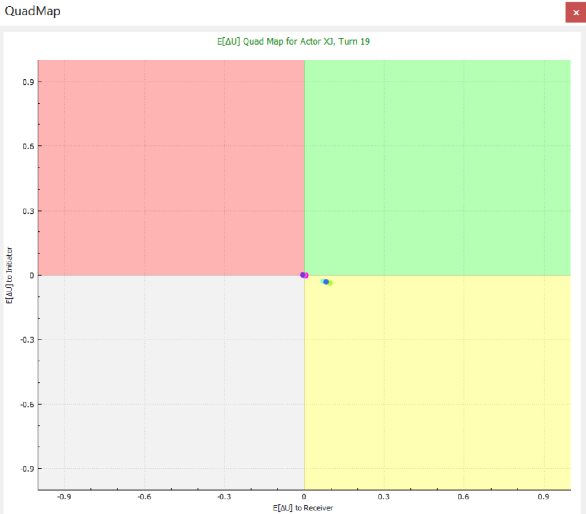

 

The quad map is named as such because the plane is divided into four quadrants, between which the behavior of receivers can be expected to consistently vary. In the first (green) quadrant, both the initiator and receiver can expect to gain utility from a challenge. Hence, actors in this quadrant may be expected to cooperate. The second (red) quadrant contains the cases where the initiator is expected to gain utility, while the receiver is expected to lose. There is likely to be conflict between actors in this quadrant. In the grey third quadrant, both actors would expect to lose utility from a challenge, so it’s unlikely any would be made. The last (yellow) quadrant contains cases where the initiator would be expected to lose utility, but the receiver would gain. Again, it’s highly unlikely any challenge would be made. You can check the auto-scale option to change the scaling to focus on where the actors are scattered on the Quad Map.

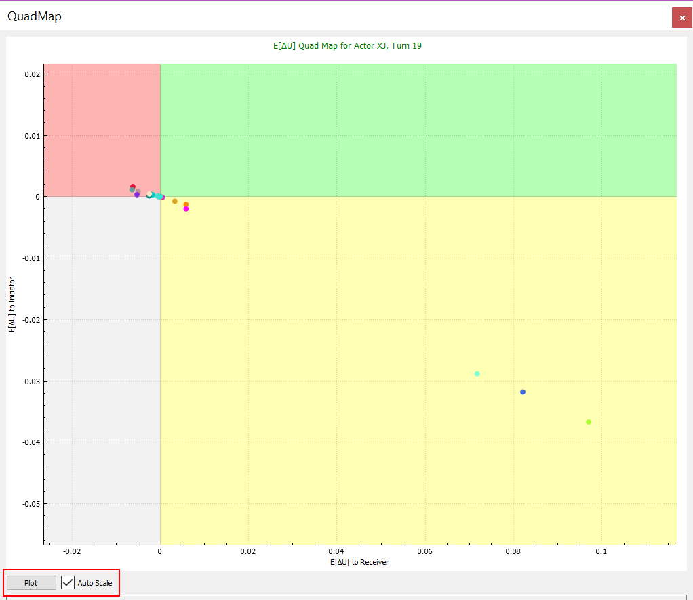

#### Changing Actor’s Colors
To Change actors’ colors displayed in the charts you can;
- Go to `Color Options > Change Actors Color`
- Or Click on the icon   from the tool bar.
- You can pick a color for each actor from the color picker widow, or you can import a color palette (which you previously designed) as a csv file from `Color Options` > Import Actor Colors`
- You can also Export a CSV color palette after modifying, so that you can use the same color map in the future, from `Color Options > Export Actor Colors`.
- Or reset the default colors for the actors. From `Color Options > Reset Actors Colors`

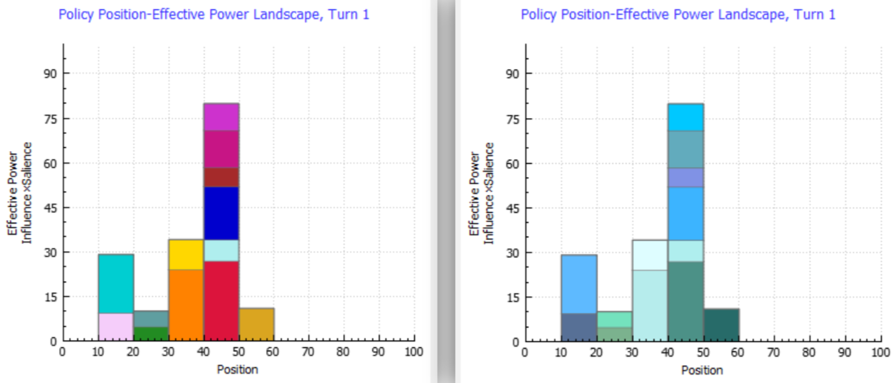

### Advanced Visualizations
As of version 1.4, the SMP application includes a new visualization dashboard that opens in your favorite browser window (Chrome, Firefox, Safari). This dashboard currently includes Line and Bar plots included in the SMP application. However, the dashboard includes an additional feature for the actor movements and the Network Diagram that displays the bargains happening between the actors as a directed network diagram. We also have plans to improve the current visualizations to make them more interactive and give you more control over the look and feel. Please note that, though the visualization dashboard opens in a browser, there is no online content, and no data is sent off your computer. The plots are all drawn using the most popular and powerful open-source set of JavaScript visualization libraries, called “D3” (Data-Driven Documents).

> Important Notes
 > - You will have to load a database file of a previous SMP run into the dashboard to visualize your data.
 > - The database file has to be less than 1.5GB as of KTAB-SMP V1.4.
 > - This dashboard is separate from the visualizations within the SMP application.

 To open the visualization dashboard, you can either click on the Open Visualization menu item, or the visualization button from the tool bar
 

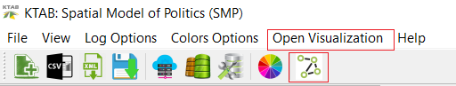

After the browser is launched click on the Browse button to load your database file

A dashboard will appear a few seconds after the data is loaded, showing you the currently available visualizations.

#### Effective Power Bar Chart (D3)

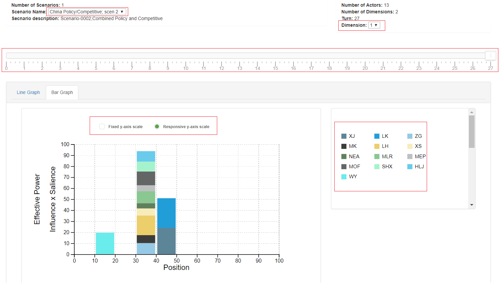

The bar chart is also like the chart embedded in the KTAB_SMP. 

With the controls on the bar chart you can:
- Change scenarios from the Scenario Name dropdown menu.
- Change dimensions from the Dimension dropdown menu.
- Scroll through turns from the turn selector slider.
- Hover over actors on the chart or from the interactive legend panel to trigger bar
highlight and effective power tool-tip.
- Disable/Enable actors using the interactive legend panel.
- Change the number of bars from “Edit and Download” button.
- Switch between a fixed and a responsive scale for the y-axis.

#### Positions Line Graph (D3)

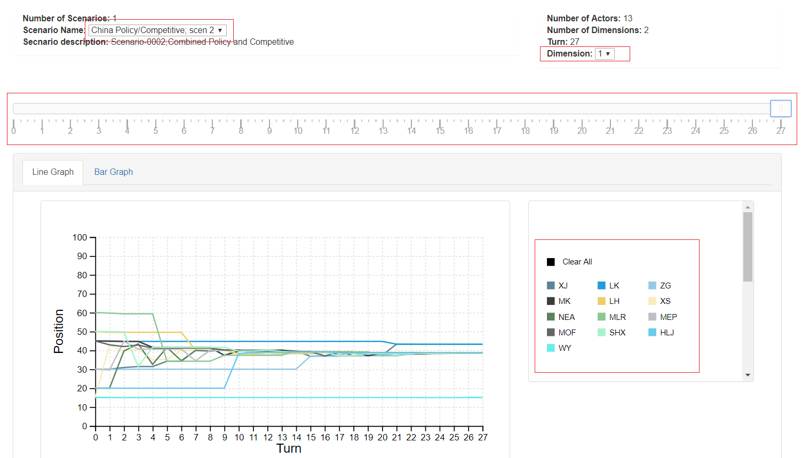

The Line chart is very similar to the chart embedded in the KTAB_SMP application. 

There are several controls that you can use in this chart:
- Change scenarios from the Scenario Name dropdown menu.
- Change dimensions from the Dimension dropdown menu.
- Scroll through turns from the turn selector slider.
- Disable/Enable actors using the interactive legend panel.
- Hover over actors to trigger line highlight.
- Click on an actor’s name from the legend to show why actor changed position’s points.
- Hover over each point to trigger a tooltip explaining why the actor’s position changed at
that point.

#### Network Diagram of Bargains (D3)

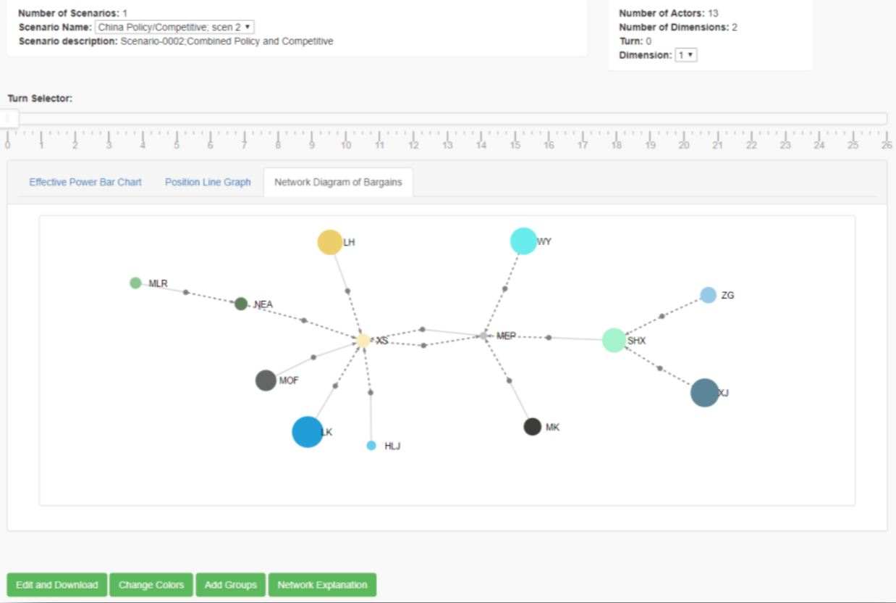

The Network Diagram is a scenario and turn specific bargains visualization. The diagram allows you to visualize the bargain proposals and acceptances for each actor in a single turn.

- Actors are represented with nodes colored according to each actor's color.
- Size of Actors' nodes represent each actor's Effective Power.
- Bargains are represented with small grey nodes.
- The edge coming to the bargain node from the actor's node represent the initiator.
- The edge coming to the actor's node from the bargain node represent the Receiver.
- All edges are directed.
- Solid-line edges represent accepted bargains, dashed edges represent rejected bargains.

#### Other controls for the D3 charts
You can switch between charts from the tabs located above the chart.

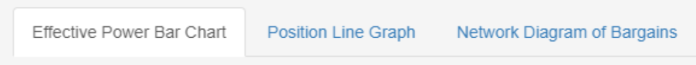

You can also customize and download the charts, change the colors of actors and add actors to groups.

#### Customize Chart Size and Download as an Image

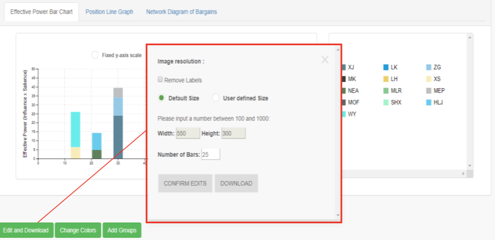

- To remove the labels from the charts simply click on the “Remove Labels” check box
- To Change the resolution/size of the charts choose “User defined Size” from the radio button then input the width and height desired
- After customizing the chart click on Confirm Edits, the application will take you back to the chart showing the confirmed changes
- To download the current view simply click on “Download”

#### Change Actors Colors

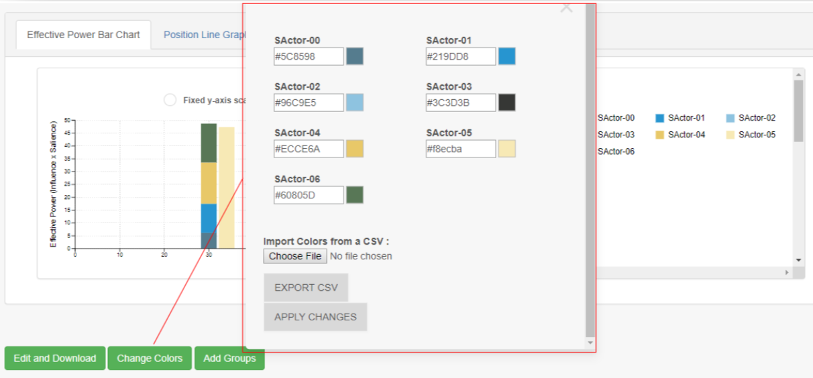

- Like the KTAB-SMP application, you can change the colors of all the actors in your view and save the selection in a CSV file.
- There are two ways to change the colors, the first method is to manually change the colors by clicking on the colored box, you will be able to choose the colors that you need from the palette. You can also input the hex code for the colors in the given boxes.
- The second method is to click on “Choose File” to upload a CSV file that includes all the colors desired, the colors are assigned by actor index.

> Note: if you do not have a CSV file with current format click on “Export CSV” to download the csv file and customize.

#### Actors Groups
- You can assign groups to actors by setting a group name and a group color for a selected number of actors.
- There are two ways add groups, the first method is to manually initialize groups by selecting the number of groups desired and assigning a color to each group.
- You can export your initialized groups as a CSV file.
- The second method is to upload a pre-defined groups from a CSV file with a specific
format.

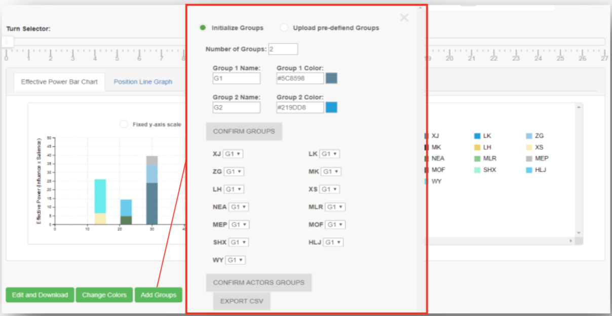

##### Sample groups CSV file
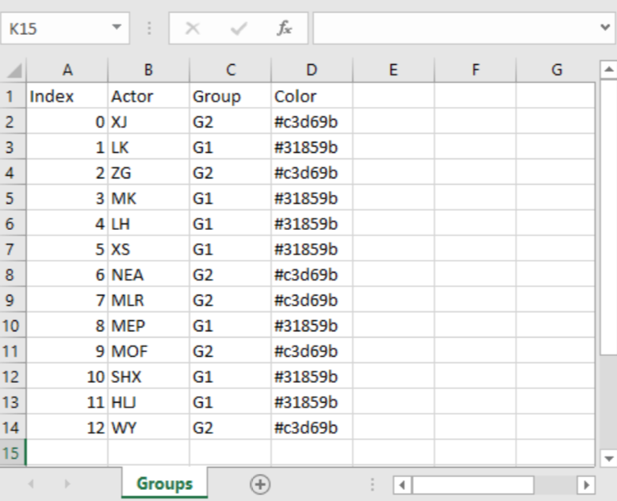

>> Note: You can find sample CSV files with desired format in /sample_data folder
